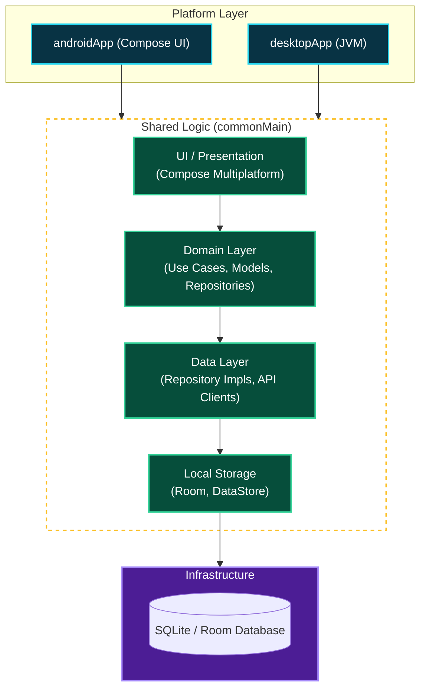
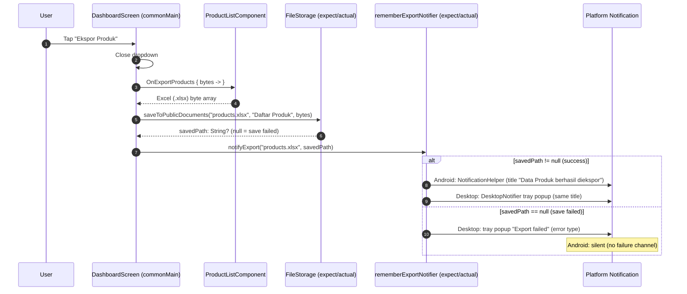

# Posle Project Architecture

This document describes the high-level architecture of the **Posle** project, a Compose Multiplatform application for Android and Desktop.

## System Overview

Posle follows a **Clean Architecture** pattern adapted for Kotlin Multiplatform (KMP), separating platform-specific UI from shared business logic and data persistence.

## Architectural Layers

### 1. Platform Apps (`androidApp`, `desktopApp`)
These modules contain platform-specific code and configuration. They depend on the `shared` module and provide the actual entry points for the application on their respective platforms.

### 2. Presentation Layer (`shared/ui`)
Powered by **Compose Multiplatform**. This layer contains the shared UI components, themes, and navigation logic. It handles the user interaction and visual state of the application.

### 3. Domain Layer (`shared/domain`)
The core of the application logic. It defines:
- **Models**: Plain Kotlin classes representing business entities (Product, Transaction, etc.).
- **Repositories**: Interface definitions for data operations.
- **Components**: Business logic holders (using Decompose or similar patterns) that manage state and events.

### 4. Data Layer (`shared/data`)
Responsible for data retrieval and persistence.
- **Repository Implementations**: Concrete logic for managing data flow between local storage and the domain.
- **DAOs**: Data Access Objects for database operations.
- **Converters**: Logic for translating between DB entities and Domain models.

### 5. Infrastructure / Storage
- **Room Database**: Cross-platform SQLite persistence for structured data.
- **DataStore**: Preferences and simple key-value storage.
- **Koin**: Dependency injection framework used to wire the layers together.

---

## Feature: Export Notifications

When a background export finishes (e.g. **Ekspor Produk** in the Product List
menu), the app shows a platform notification so the user knows the file is
ready — **"Data Produk berhasil diekspor"**.

The notification path is fully cross-platform: the shared UI decides *what* to
notify, and an `expect`/`actual` bridge decides *how* to show it on each
platform.

### Flow

### Key files

| File | Location | Role |
|---|---|---|
| `PlatformExportNotification.kt` | `shared/commonMain/.../ui/platform` | `expect fun rememberExportNotifier(): (fileName, savedPath) -> Unit` |
| `PlatformExportNotification.android.kt` | `shared/androidMain/.../ui/platform` | `actual` → delegates to `NotificationHelper` |
| `PlatformExportNotification.jvm.kt` | `shared/jvmMain/.../ui/platform` | `actual` → delegates to `DesktopNotifier` |
| `NotificationHelper.kt` | `shared/androidMain/.../util` | Android notifications (mime-aware: PDF & XLSX) |
| `DesktopNotifier.kt` | `shared/jvmMain/.../util` | Desktop system-tray popups |
| `strings.xml` | `shared/commonMain/composeResources/values` | `notification_export_success` = "Data Produk berhasil diekspor" |

### Design notes

- **Callback, not composable**: `rememberExportNotifier()` returns a plain
  `(fileName, savedPath) -> Unit` callback (same pattern as
  `rememberImagePickHandler`) so it can be invoked from `onClick` lambdas and
  coroutines, not only from composition.
- **Save result drives the notification**: the shared code passes the
  `String?` returned by `FileStorage.saveToPublicDocuments` — a non-null value
  means success, `null` means the save failed.
- **Title is shared**: both platform actuals read the same
  `notification_export_success` string resource, so the title stays consistent
  across platforms and is localized from one place.
- **PDF recap reuse**: `NotificationHelper.notifySuccess` (Android) and
  `DesktopNotifier.notifyPdfGenerated` (desktop) reuse the same moved helpers;
  the PDF flow keeps its own title ("Laporan Selesai") via the default
  parameter. Both helpers live in `shared` so the common bridge can reach them.

---

*Generated by Hermes Agent on 2026-08-01*
