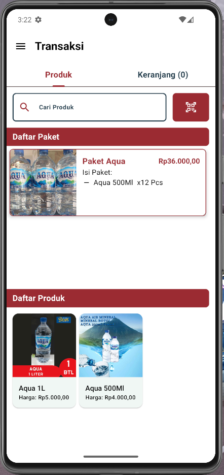
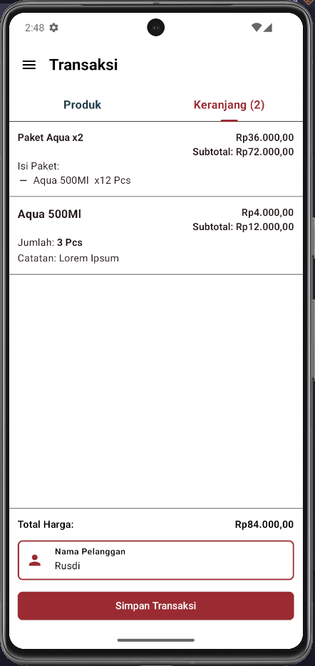
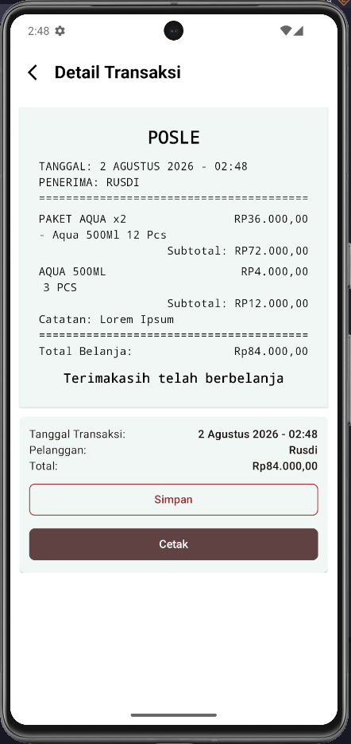
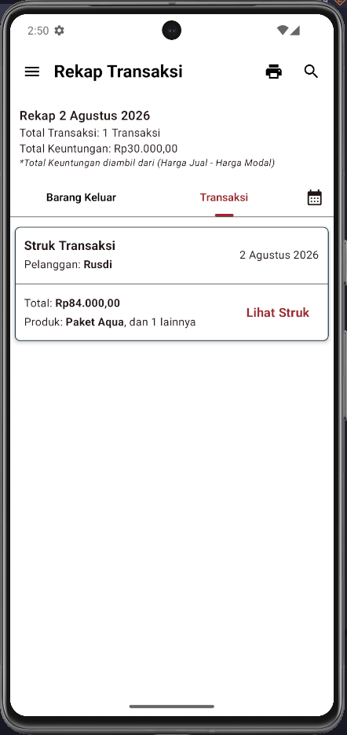
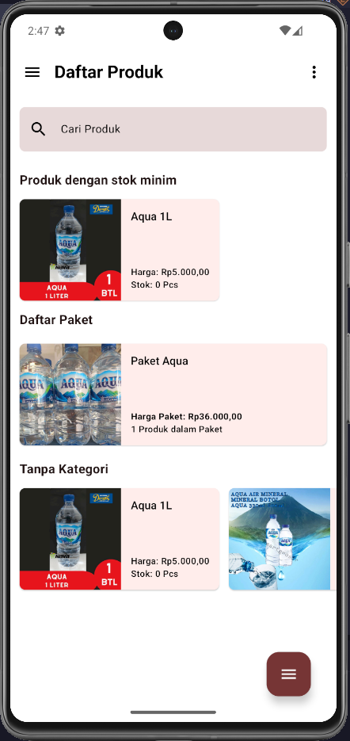
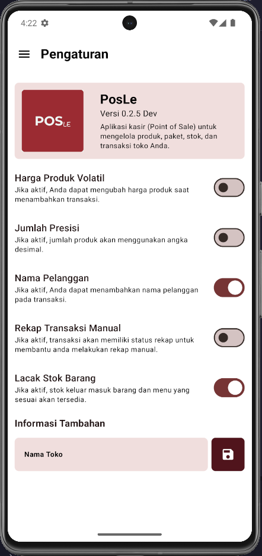

# PosLe Screenshots

> 📸 Screenshots of the PosLe app (Android). Images live in the
> [`screenshots/`](./screenshots/) folder. To add more, drop a PNG there and
> reference it in a table below — it renders directly on GitHub.

---

## Transactions

| | | |
|---|---|---|
|  |  |  |

*Product selection tab · Cart with items (customer "Rusdi") · Detail transaksi with receipt & print/save actions*

## Recap

| |
|---|
|  |

*Rekap Transaksi — daily summary, profit, transaction list with "Lihat Struk"*

## Products

| |
|---|
|  |

*Daftar Produk — search, low-stock section, bundles, uncategorized products*

## Settings

| |
|---|
|  |

*Pengaturan — About card (logo, "Versi 0.2.5 Dev"), feature toggles, store-name field*

> ⚠️ **Stale screenshot:** this settings capture predates the latest changes —
> it still shows the **"Jumlah Presisi" toggle** (removed) and the old store-name
> field (now a `BorderedTextField`). Replace it with a fresh capture when
> convenient.

---

*Screenshots: Android build (debug). Generated on 2026-08-02.*
